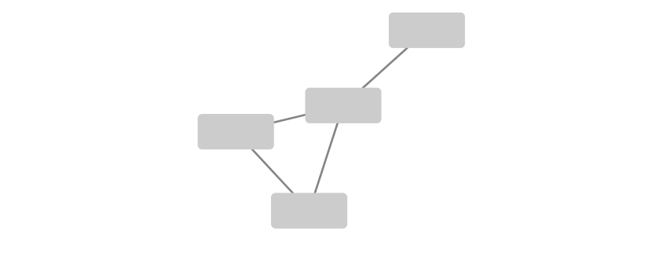
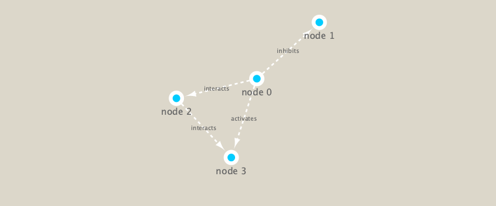

```{r setup, include=FALSE}
knitr::opts_chunk$set(echo = TRUE)
```

## First setup the packages we need. These include **igraph** from CRAN and **RCy3** from bioconductor.

I installed these with **install.packages("igraph")** and **Biomanager::instal("RCy3)**

```{r}
library(RCy3)
```

Let's check if we can talk to cytoscape from R. 

```{r}
cytoscapePing()
```

# Check the version
```{r}
cytoscapeVersionInfo()
```

```{r}
g <- makeSimpleIgraph()
createNetworkFromIgraph(g,"myGraph")
```

```{r}
fig <- exportImage(filename="demo", type="png", height=350)

```

```{r}
setVisualStyle("Marquee")
fig <- exportImage(filename="demo_marquee", type="png", height=350)


```

```{r}
styles <- getVisualStyleNames()
styles
```

```{r}
plot(g)
```

# Read our metagenomics data

Our data from today comes from the TARA coeans study

```{r}
## scripts for processing located in "inst/data-raw/"
prok_vir_cor <- read.delim("virus_prok_cor_abundant.tsv", stringsAsFactors = FALSE)

## Have a peak at the first 6 rows
head(prok_vir_cor)
```


```{r}
nrow(prok_vir_cor)
```


Use the igraph function
```{r}
install.packages("igraph")
library(igraph)

g <- graph.data.frame(prok_vir_cor, directed = FALSE)
class(g)
g
```

```{r}
plot(g)
```


Community structure detection algorithms try to find dense sub-graphs within larger network graphs (i.e. clusters of well connected nodes that are densely connected themselves but sparsely connected to other nodes outside the cluster) . Here we use the classic Girvan & Newman betweenness clustering method. The igraph package has lots of different community detection algorithms (i.e. different methods for finding communities).

```{r}
cb <- cluster_edge_betweenness(g)
plot(cb, y=g, vertex.label=NA,  vertex.size=3)
```


